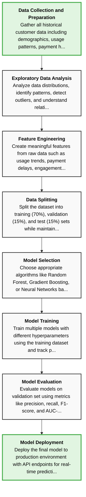

# Problem Breakdown Agent

A minimal MVP for an AI agent that analyzes complex problems and breaks them down into actionable steps with visual Mermaid diagrams.

## Features

- Natural language problem input
- Structured step-by-step breakdown with dependencies
- Automatic Mermaid flowchart generation
- Clean TypeScript implementation
- Deployable as Vercel serverless function
- Test-Driven Development (TDD) workflow
- Comprehensive documentation tracking

## Setup

### Prerequisites

- Node.js 18+ (LTS recommended)
- OpenAI API key
- Vercel CLI (optional, for deployment)

### Installation

1. Clone the repository:
```bash
git clone <repository-url>
cd problem-breakdown-agent
```

2. Install dependencies:
```bash
npm install
```

3. Create a `.env` file from the example:
```bash
cp .env.example .env
```

4. Add your OpenAI API key to `.env`:
```
OPENAI_API_KEY=sk-your-actual-api-key-here
```

## Usage

### Local Development

Run the development server:
```bash
npm run dev
```

### Testing

Run tests (required before commits):
```bash
npm test
```

Run tests in watch mode:
```bash
npm run test:watch
```

Generate coverage report:
```bash
npm run test:coverage
```

### Build for Production

Build the TypeScript code:
```bash
npm run build
```

Run the built version:
```bash
npm start
```

### Deploy to Vercel

1. Install Vercel CLI:
```bash
npm i -g vercel
```

2. Deploy:
```bash
vercel
```

3. Set environment variable in Vercel dashboard:
   - Add `OPENAI_API_KEY` with your API key

## API Endpoint

### POST `/api/analyze`

Analyzes a complex problem and returns structured steps.

**Request:**
```json
{
  "problem": "Your complex problem description here"
}
```

**Response:**
```json
{
  "success": true,
  "data": {
    "steps": [
      {
        "id": "step1",
        "title": "Step title",
        "description": "Detailed description",
        "dependencies": []
      }
    ],
    "mermaidDiagram": "flowchart TD...",
    "summary": "Problem summary and approach"
  }
}
```

## Example

### Input Problem:
```
"I need to build a machine learning model to predict customer churn for a subscription service. I have historical customer data including demographics, usage patterns, and payment history."
```

### Expected Output:

**Steps:**
```json
[
  {
    "id": "step1",
    "title": "Data Collection and Preparation",
    "description": "Gather all historical customer data including demographics, usage patterns, payment history, and churn status. Ensure data is complete and properly formatted.",
    "dependencies": []
  },
  {
    "id": "step2",
    "title": "Exploratory Data Analysis",
    "description": "Analyze data distributions, identify patterns, detect outliers, and understand relationships between features and churn outcomes.",
    "dependencies": ["step1"]
  },
  {
    "id": "step3",
    "title": "Feature Engineering",
    "description": "Create meaningful features from raw data such as usage trends, payment delays, engagement scores, and customer lifetime value indicators.",
    "dependencies": ["step2"]
  },
  {
    "id": "step4",
    "title": "Data Splitting",
    "description": "Split the dataset into training (70%), validation (15%), and test (15%) sets while maintaining class balance.",
    "dependencies": ["step3"]
  },
  {
    "id": "step5",
    "title": "Model Selection",
    "description": "Choose appropriate algorithms like Random Forest, Gradient Boosting, or Neural Networks based on data characteristics and business requirements.",
    "dependencies": ["step4"]
  },
  {
    "id": "step6",
    "title": "Model Training",
    "description": "Train multiple models with different hyperparameters using the training dataset and track performance metrics.",
    "dependencies": ["step5"]
  },
  {
    "id": "step7",
    "title": "Model Evaluation",
    "description": "Evaluate models on validation set using metrics like precision, recall, F1-score, and AUC-ROC. Select the best performing model.",
    "dependencies": ["step6"]
  },
  {
    "id": "step8",
    "title": "Model Deployment",
    "description": "Deploy the final model to production environment with API endpoints for real-time predictions and batch processing capabilities.",
    "dependencies": ["step7"]
  }
]
```

**Mermaid Diagram:**


**Summary:**
"To build a customer churn prediction model, systematically process your historical data through preparation, analysis, and feature engineering stages. Then train and evaluate multiple machine learning models to identify the best performer before deploying to production for real-time predictions."

## Testing with cURL

```bash
curl -X POST http://localhost:3000/api/analyze \
  -H "Content-Type: application/json" \
  -d '{
    "problem": "I need to build a machine learning model to predict customer churn for a subscription service."
  }'
```

## Project Structure

```
problem-breakdown-agent/
├── api/
│   └── analyze.ts         # Vercel serverless endpoint
├── src/
│   ├── types/
│   │   └── index.ts       # TypeScript interfaces and types
│   └── lib/
│       ├── analyzer.ts    # OpenAI problem analysis logic
│       └── mermaid-generator.ts  # Mermaid diagram generation
├── .env.example           # Environment variables template
├── .gitignore            # Git ignore rules
├── package.json          # Dependencies and scripts
├── tsconfig.json         # TypeScript configuration
├── vercel.json           # Vercel deployment configuration
└── README.md            # This file
```

## Technologies Used

- **TypeScript**: Type-safe code
- **OpenAI API**: AI-powered problem analysis
- **Vercel**: Serverless deployment platform
- **Mermaid**: Flowchart diagram generation

## Development Workflow

This project follows strict development practices to ensure code quality:

### Test-Driven Development (TDD)
1. **Write tests first** - Before implementing any feature
2. **Red-Green-Refactor** - Tests fail → Make them pass → Improve code
3. **Maintain >80% coverage** - Run `npm run test:coverage` to check

### Documentation Requirements
- **decision-log.md** - Record all technical decisions
- **change-log.md** - Log every change with timestamp
- **todo.md** - Track all tasks and their status

### Commit Standards
Every commit must:
- Use format: `<type>: <brief description>`
- Types: feat, fix, test, docs, refactor, style, chore
- Pass all tests (`npm test`)
- Update change-log.md

### Important Files
- `decision-log.md` - Technical decisions and rationale
- `change-log.md` - Chronological change history
- `todo.md` - Task planning and tracking
- `CLAUDE.md` - AI assistant guidelines

## License

ISC